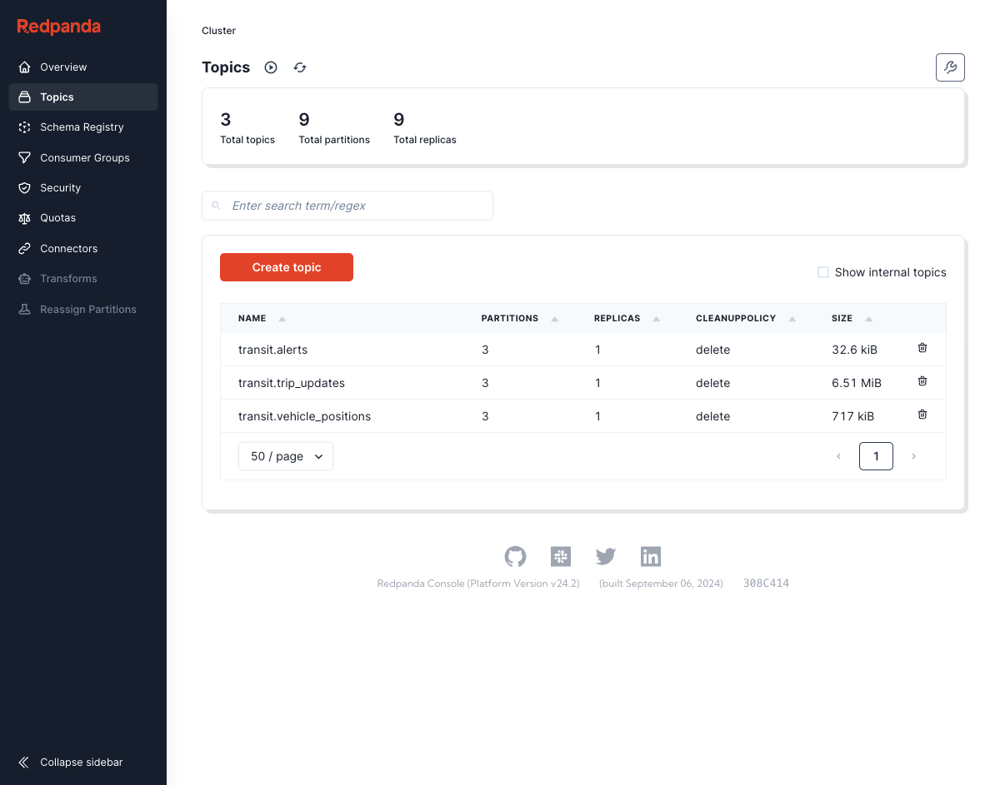

# Transit

A multi-city transit reliability warehouse. One question: **which cities run the most
reliable public transit — and what makes them reliable?**

Nine cities planned (NYC, Chicago, DC, Boston, SF Bay, Toronto, Zurich, Helsinki, Tokyo),
three real-time formats (GTFS-RT protobuf, ODPT JSON, MQTT). Full plan and verified
per-feed facts live in [`docs/`](docs/).

**Status: Phase 1 — NYC subway vertical slice, running end-to-end locally.**

## Architecture (local slice)

```
MTA subway (8 GTFS-RT feeds, 30s poll)
        │  raw bytes ──────────────► MinIO raw/ (hourly prefixes, replay archive)
        ▼
  gtfs_rt adapter ── canonical envelopes ──► Redpanda
                                    transit.{trip_updates,vehicle_positions,alerts}
        ▼
  Spark Structured Streaming (4 checkpointed queries)
    bronze_writer      Kafka ──► Iceberg bronze.envelopes
    silver_normalize   Kafka ──► Iceberg silver.{stop_time_predictions,vehicle_positions,alerts}
                       typing · exact-dup drop (2h watermark) · canonical trip_uid
        ▼
  Iceberg on MinIO (Hadoop catalog, partitioned city/service_date)
    + silver.gtfs_static_* (versioned weekly pulls, Spark-parsed)
        ▼
  dbt (duckdb reads Iceberg directly via iceberg_scan)
    stg → int_trip_matching_nyc → int_gtfs_scheduled_stop_times
        → int_stop_events_finalized → fct_stop_events
```

Cloud phases swap MinIO→S3, duckdb→Snowflake, add EMR Serverless + Terraform. Same code,
different profiles; nothing cloud-side exists yet by design.

## Quickstart

```sh
cp .env.example .env       # no keys needed for NYC
uv sync
make up                    # Redpanda(+console :8080), MinIO(:9001), Postgres, Dagster(:3070)
make record-fixtures       # one live snapshot per feed -> tests/fixtures/
make test                  # 54 tests, fixtures only, no network
make poll-nyc              # MTA poller -> Kafka + raw archive (leave running)
make spark-local           # bronze + silver streams (leave running)
make gtfs-static           # NYC static GTFS -> silver.gtfs_static_*
make dbt-build             # silver -> fct_stop_events, 23 models+tests
uv run python scripts/proof_nyc.py   # OTP% by route/hour + spot-check samples
```

Requires uv, Docker, Java 17 (`brew install openjdk@17`). No API keys, no cloud accounts.

## Proof of work

Evidence with reproduce commands: [`docs/phase1-evidence.md`](docs/phase1-evidence.md).

| Layer | After ~100 min of polling |
|---|---|
| raw/ | 704 protobuf snapshots, hourly prefixes |
| Kafka | ~1,500 envelopes across 3 topics |
| silver.stop_time_predictions | 222k prediction rows, 1,057 distinct trips |
| trip matching | 100% of RT trips matched to static (60% exact-token, rest route+direction+origin-time) |
| trip_uid canonical rule | recomputed in duckdb over full table: 0 violations |



## NYC feed findings (fixture-verified, they shape the pipeline)

- 7 of 8 feeds omit `arrival.delay` and `stop_sequence`; the **L feed (CBTC) provides both**.
  Delay is therefore computed vs the static schedule, `COALESCE`d with feed delay.
- RT trip_ids are origin-time-encoded (`070950_A..S58R`, prefix = centiminutes after
  midnight) and only ~60% token-match static trip_ids (path variants like `..S07X003`) →
  matcher keys on (route, direction, service_date, origin-time) with confidence tiers.
- `direction_id` is unusable (absent in 7 feeds; always 0 on L, even northbound) →
  direction parses from the `..N/..S` trip_id suffix.
- Subway VehiclePositions carry no lat/lon; VP status fields are missing on ~half of
  trains and timestamps drift (future-dated up to +58 min) → v1 finalization uses
  last-prediction-before-passage, not VP passage detection.
- `vehicle.id` never appears; train identity lives only in the NYCT protobuf extension.

Full field-level dictionary: [`docs/01-data-dictionary.md`](docs/01-data-dictionary.md).

## Layout

| Path | Contents |
|---|---|
| `ingestion/` | config-driven adapters (`config/cities/*.yaml`), poller, fixture recorder |
| `spark_jobs/` | bronze/silver streaming, static GTFS parser, shared time semantics |
| `dbt/transit/` | staging → intermediate → marts; otp_band + timezone macros; custom tests |
| `orchestration/` | Dagster (webserver+daemon in compose; assets land in Phase 5) |
| `tests/` | fixture-decode + unit tests; no live calls |
| `docs/` | plan, data dictionary, warehouse schema, dbt spec, deliverables, evidence |
| `infra/` | Terraform: bootstrap (state bucket) + envs/dev wiring lake, network, kafka, EMR Serverless, services, Snowflake modules |

## Data licenses

See [ATTRIBUTION.md](ATTRIBUTION.md). NYC data provided by the MTA.
