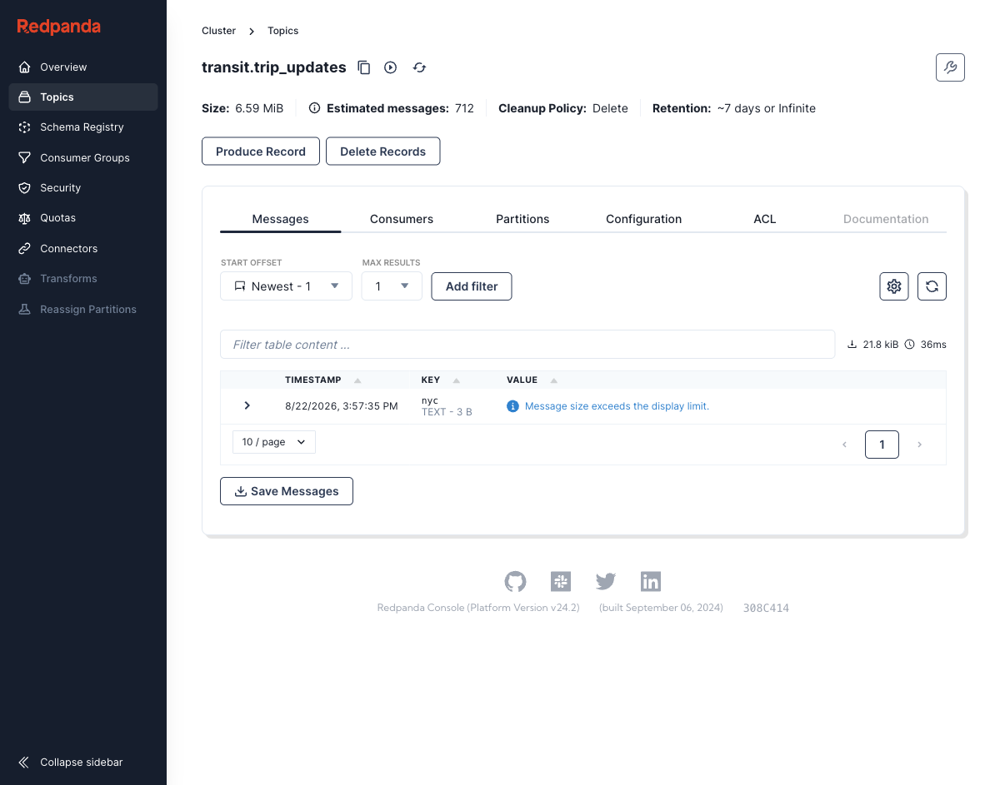
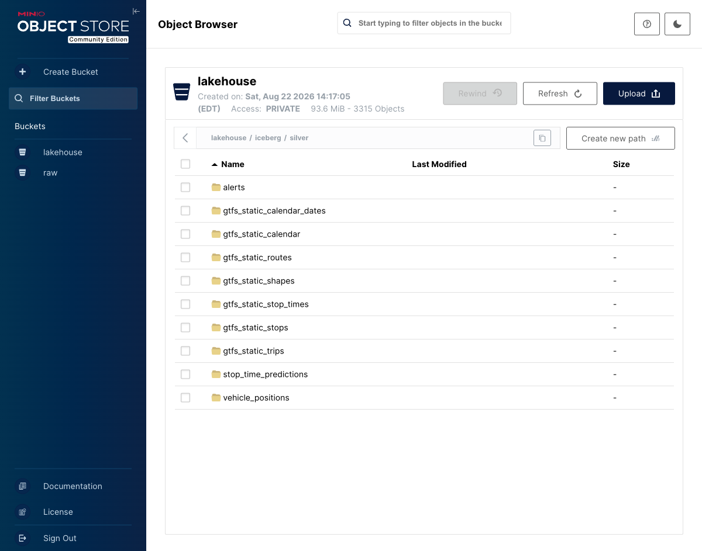
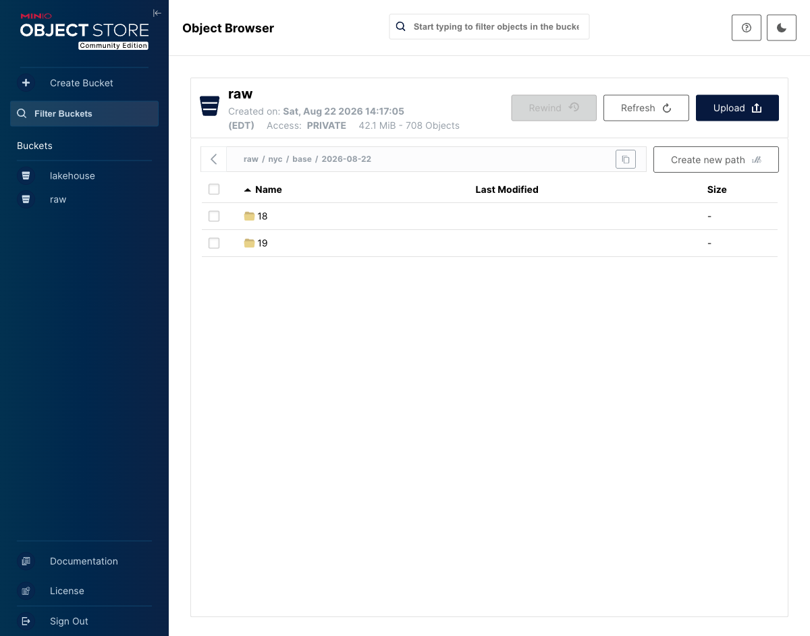
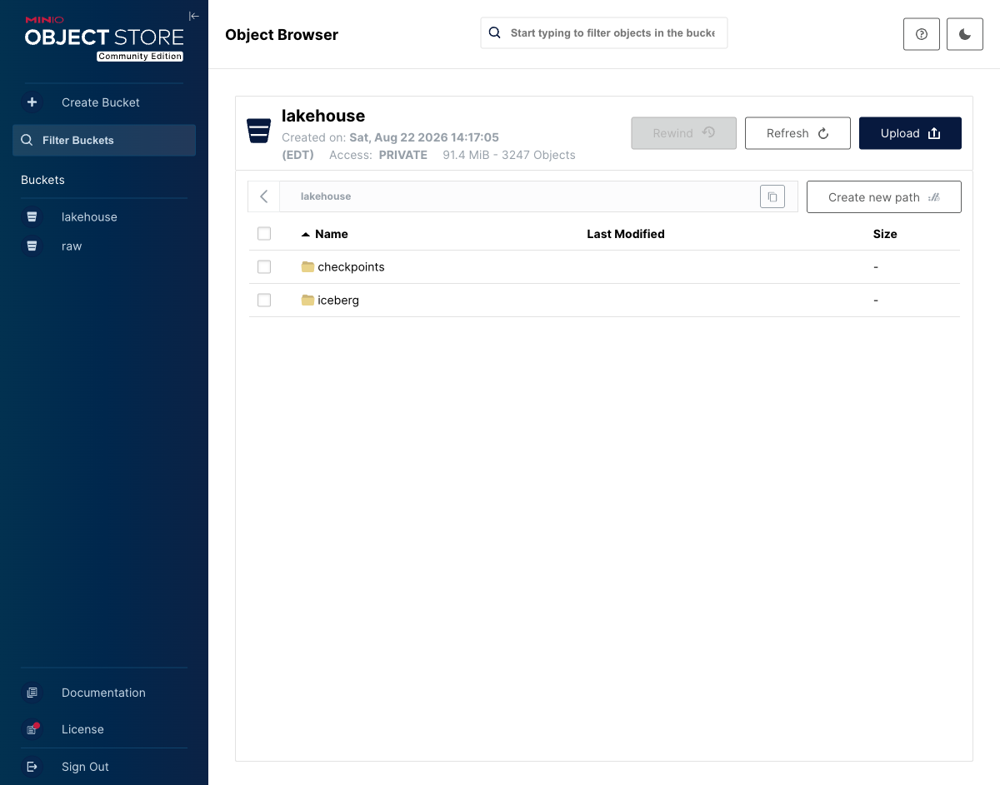
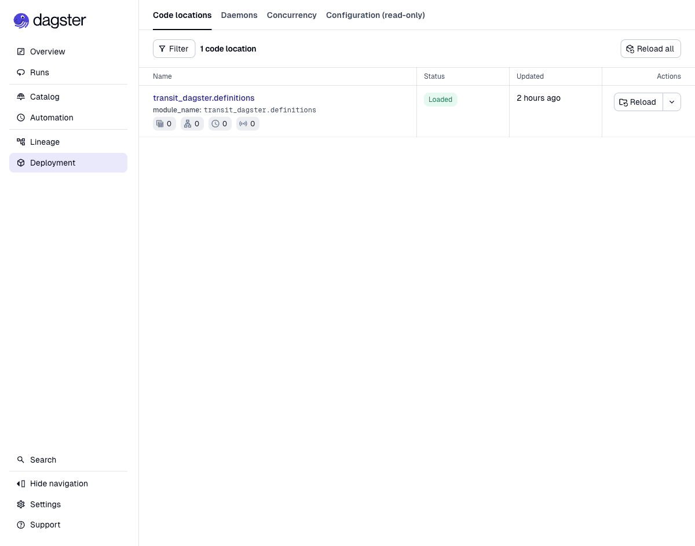

# Phase 1 evidence — NYC vertical slice (local)

Date: 2026-08-22. Every number below has a reproduce command; run them against a live
stack (`make up`, poller + spark-local running).

## Method

- Fixture-first: 8 live snapshots recorded once (`make record-fixtures`), all unit tests
  decode fixtures — no network in tests or CI.
- A second, context-free audit agent independently re-decoded the fixtures with its own
  scanner (including raw protobuf wire scan of NYCT extension field 1001) and verified
  every claim in the data dictionary's NYC row: 12 confirmed, 4 corrected, all folded
  into `01-data-dictionary.md` §B.
- The canonical `trip_uid` rule is implemented once (Spark) and re-verified independently
  in duckdb over the full silver table.

## Verification battery (all green)

| Check | Command | Result |
|---|---|---|
| Unit tests | `make test` | 54 passed |
| Lint | `make lint` | clean |
| Compose health | `docker compose ps` | 6/6 up, healthchecked |
| dbt build | `make dbt-build` | 23/23 PASS (models, seed, 10 data tests) |
| Secrets hygiene | `git ls-files \| grep .env` | nothing tracked |

## Cross-layer reconciliation (~100 min of polling)

| Layer | Measure | Value |
|---|---|---|
| raw/ (MinIO) | objects under `nyc/` | 704 ≈ 88 poll cycles × 8 feeds |
| Kafka | high-watermark sum, 3 topics | 1,496 envelopes |
| bronze.envelopes | rows by feed | 696 TU + 696 VP + 87 alerts = 1,479 (≈1 cycle behind Kafka, catch-up lag) |
| silver.stop_time_predictions | rows / distinct trips | 222,580 / 1,057 |
| L-feed quirk | rows with feed-provided delay | 3,554 — only on route L, exactly per dictionary §B① |
| trip_uid rule | `sha256(city|service_date|trip_id)` recomputed in duckdb | 0 mismatches in 222k rows |
| Exact-dup drop | duplicate (trip_uid, stop, prediction values, fetched_at) groups | none (max group size 1) |

Reconciliation probe: see `scripts/proof_nyc.py` and the inline snippets in git history;
silver counts via `iceberg_scan('s3://lakehouse/iceberg/silver/stop_time_predictions')`.

## Trip matching (int_trip_matching_nyc)

RT→static coverage on day one: 100% of RT trips matched; ~60% by exact origin-time-token
equality (confidence 1.0), the rest by (route, direction-from-suffix, nearest origin time
≤3 min) at 0.9 (same minute) / 0.7. Mismatch causes are documented RT variants: path
suffixes (`..S07X003` vs static `..S07R`), missing track on L, intraday origin drift.

## Incidents during the run

- One transient MinIO 403 on a checkpoint `getFileStatus` killed two silver queries
  (18:54Z). Fix: supervisor loop in `spark_jobs/run_local.py` rebuilds the session on
  stream failure; restart was lossless (Kafka offsets + Iceberg commits in checkpoints).
- Docker Desktop image pulls deadlocked via a hanging `docker-credential-desktop`
  keychain helper; removed `credsStore` from `~/.docker/config.json` (no stored auths).
  Machine-level, not repo-level.

## Screenshots

| | |
|---|---|
| Redpanda topics (3 transit.* topics) |  |
| transit.trip_updates messages, keyed `nyc` |  |
| Iceberg silver tables on MinIO |  |
| raw/ hourly archive prefixes |  |
| Lakehouse bucket (91 MiB, 3.2k objects at capture) |  |
| Dagster deployment (code location loaded) |  |

## OTP proof (step 8)

Appended after ≥3h of data accrual — `make dbt-build && uv run python scripts/proof_nyc.py`:
OTP% + median delay by route × local hour, and 10 finalized stop events spot-checked
against a live tracker.
